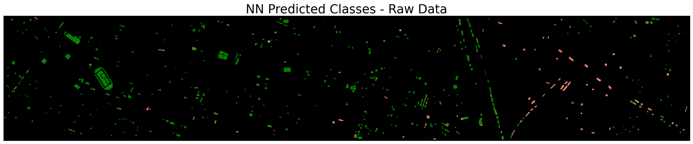

# Houston Hyperspectral Image Classification 🛰️

The dataset was part of the [2013 Data Fusion Contest](https://machinelearning.ee.uh.edu/2013-ieee-grss-data-fusion-contest/) organized by the Data Fusion Technical Committee.

### Regions of Interest (ROIs)

This is a multi-classification problem with 15 regions of interest (ROIs):

1 -- Healthy grass\
2 -- Stressed grass\
3 -- Synthetic grass\
4 -- Trees\
5 -- Soil\
6 -- Water\
7 -- Residential\
8 -- Commercial\
9 -- Road\
10 -- Highway\
11 -- Railway\
12 -- Parking Lot 1\
13 -- Parking Lot 2\
14 -- Tennis Court\
15 -- Running Track

## Dataset Overview

The project combines Hyperspectral images (HSI) with LiDAR images to improve the classification accuracy of data collected from remote sensing devices.\
The training set is generally balanced. Interestingly, the area covered by the cloud was excluded (presumably by design), which is where most misclassification occurred.

 <em>Figure 1: Training Indices</em> 

 <em>Figure 2: Testing Indices</em> 

 <em>Figure 3: Combined Training and Testing Indices</em> 

.png)

 <em>Figure 4: Regions of Interest</em> 

 <em>Figure 5: LiDAR Image</em> 

---

## Project Goals 🎯

1. **Multi-class Classification**: Classify land cover types using HSI and LiDAR data
2. **Data Fusion**: Explore the impact of combining HSI and LiDAR data on classification performance
3. **Noise Reduction**: Investigate the effectiveness of denoising techniques

---

## Techniques Used

### 1. Robust PCA (RPCA)
Robust PCA was used to remove noise from hyperspectral images. The algorithm was developed by [Candès et al. 2011](https://people.eecs.berkeley.edu/~yima/psfile/JACM11.pdf), based on the original work of [Lin et al. 2009](https://people.eecs.berkeley.edu/~yima/matrix-rank/Files/rpca_algorithms.pdf).

#### Noise Decomposition
The method assumes that the noise is sparse and tries to decompose the image into:
- A low-rank component (smooth)
- A sparse component (noisy)

The model is then trained on the smooth component.

### 2. Classification Models
Two primary models were compared:
- Support Vector Machine (SVM)
- Simple Neural Network (SNN)

---

## Data Preprocessing

I compared four sets of data:
1. Raw HSIs
2. Raw HSI + LiDAR
3. Denoised HSI
4. Denoised HSI + LiDAR

### Noise Characteristics

The images were generally not noisy, but some spectral bands had a dark overlay caused by a few white pixels whose values exceed 10,000, while other pixels did not exceed 2,600. This skewed the color map, appearing like a dark film.

Due to the extremely sparse nature of this noise, careful hyperparameter tuning was necessary to avoid removing important features.

### Visualization of Noise Decomposition

 <em>Figure 6: Raw Hyperspectral Image</em> 

.png)

 <em>Figure 7: Denoised Low Rank Component</em> 

 <em>Figure 8: Noise Component</em> 

---

## Results & Discussion

### Model Performance

 

 <em>Figure 9: Model Performance Comparison</em> 

Key observations:
- The SNN performed slightly better than SVM.
- The LiDAR image was not affected by the cloud, which explains the improved accuracy for SVM and SNN that were trained on the combined images.
- Denoising did not consistently improve performance, likely because the images were not excessively noisy. This dataset may not have been ideal for evaluating the effectiveness of RPCA denoising.
- NN models incorporating LiDAR consistently achieved higher accuracy. However, due to the highly non-convex nature of neural networks, their solutions depend heavily on factors such as the optimization method, learning rate, number of iterations, and convergence criteria..

### Prediction Visualizations

These visualizations should be compared side-by-side with the ground truths in Figure 1 and 2.

#### SVM Predictions:

#### SNN Predictions:

### Key Insights
- Training classes were balanced, but spatial distribution was not.
- Shadow areas showed poorest prediction, especially for SVM
- SNN demonstrated better prediction in shadow regions, particularly with LiDAR

---

## Conclusion

In a real-world scenario, models would be expected to train on data collected under various conditions, including shadow regions. The current models performed well outside the shadow area, suggesting that in many cases, the LiDAR image might not be needed.

---

## Project Structure:

[Main Notebook](main-Houston-HSI.ipynb)

[Used Packages](used_packages.py)

[Data Processing](data.py)

[Classification Models](models.py)

[Utility Functions](utils.py)

[RPCA Image Decomposition](RPCA.py)

[Saved NN Models](saved%20models/best%20models)

## Author:

Ali Moughnieh: [@amoughnieh](https://github.com/amoughnieh)
